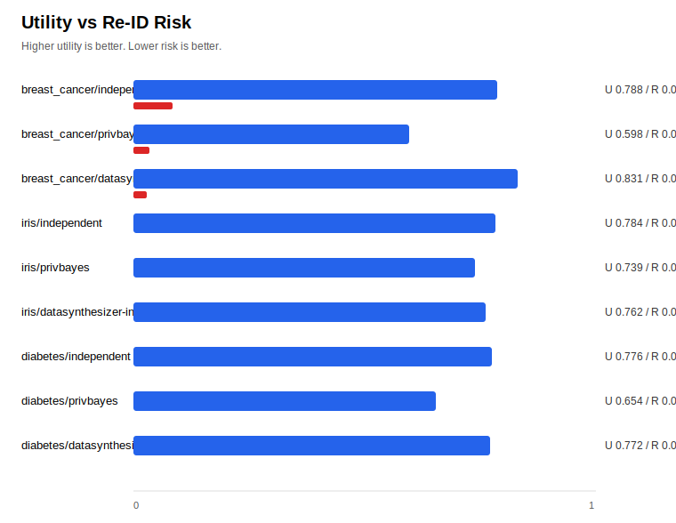

# SynthHub

[](https://github.com/tauptlab/synthhub/actions/workflows/ci.yml)
[](LICENSE)
[](pyproject.toml)
[](#project-status)
[](https://colab.research.google.com/github/tauptlab/synthhub/blob/main/examples/quickstart.ipynb)

SynthHub is a dataframe-first Python library for differentially private
synthetic data. It gives DP synthesizers a small, scikit-learn-like interface:

```python
from synthhub import Synthesizer

synth = Synthesizer(method="privbayes", epsilon=1.0, random_state=0)
synth.fit(real_df)
synth_df = synth.sample(1000)
report = synth.evaluate(real_df, synth_df, target="label")
```

The goal is not to invent another synthetic-data algorithm. SynthHub wraps
existing DP engines behind one API, then makes preprocessing, evaluation, and
privacy accounting visible in a common report.

## Contents

- [Why SynthHub](#why-synthhub)
- [Project Status](#project-status)
- [Install](#install)
- [Quickstart](#quickstart)
- [Backends](#backends)
- [Benchmark](#benchmark)
- [Privacy Contract](#privacy-contract)
- [Development](#development)
- [Roadmap](#roadmap)

## Why SynthHub

DP synthetic-data tooling is fragmented. Popular synthetic-data libraries often
separate privacy guarantees from their default open-source workflow, while
research-oriented DP implementations expose different data formats, schema
assumptions, and accounting conventions.

SynthHub focuses on the integration layer:

- one pandas `DataFrame` API for fitting, sampling, and evaluation
- backend adapters for DP synthesizers such as PrivBayes, AIM, MST, MWEM, and
  PATE/DP GAN families
- explicit `PrivacyReport` output for requested epsilon, spent epsilon, delta,
  backend identity, and warnings
- utility and privacy audit metrics for comparing methods under the same
  dataset and epsilon

Where SynthHub fits:

| Project | Best at | SynthHub difference |
|---|---|---|
| SDV | Broad synthetic-data product surface | DP-first open adapter layer with explicit accounting reports. |
| SmartNoise Synth | DP mechanisms and synthesizers | Dataframe-first wrapper, common preprocessing, and shared evaluation. |
| SynthCity | Large research-oriented synthetic-data suite | Smaller API focused on DP backend switching and comparable reports. |
| DataSynthesizer | Classic DP PrivBayes implementation | Modern package shell, tests, benchmark, and unified `Synthesizer` API. |

## Project Status

SynthHub is in alpha. The public API is intentionally small, but backend
coverage and evaluation reports are still evolving.

What is solid today:

- core `Synthesizer.fit/sample/evaluate` flow
- schema inference and explicit public schema support
- DataSynthesizer PrivBayes live smoke coverage
- Private-PGM AIM/MST live smoke coverage with upstream mechanisms
- SmartNoise MWEM/AIM/MST live smoke coverage
- adapter contract tests for optional backends
- CI across Python 3.10, 3.11, and 3.12 for the core package
- package build and metadata checks in CI
- PyPI trusted-publishing workflow prepared

What is still experimental:

- SmartNoise GAN and SynthCity adapters are contract-tested but not yet
  live-tested in CI
- Private-PGM AIM/MST require external mechanism modules on `PYTHONPATH`
- membership-inference scoring is an audit heuristic, not a DP proof
- PyPI release is pending; install from GitHub for now

## Install

Install the current development version from GitHub:

```bash
python -m pip install "synthhub[datasynthesizer] @ git+https://github.com/tauptlab/synthhub.git"
```

After the first PyPI release:

```bash
python -m pip install "synthhub[datasynthesizer]"
```

Optional backend families:

```bash
python -m pip install "synthhub[smartnoise]"
python -m pip install "synthhub[synthcity]"
python -m pip install "synthhub[private-pgm]"
```

Private-PGM AIM/MST also require the upstream `mechanisms/` folder on
`PYTHONPATH`; see [`docs/private-pgm.md`](docs/private-pgm.md).

For local development:

```bash
git clone https://github.com/tauptlab/synthhub.git
cd synthhub
python -m pip install -e ".[test,datasynthesizer]"
python -m pytest -q
```

## Quickstart

```python
import pandas as pd
from synthhub import Synthesizer

real_df = pd.DataFrame(
    {
        "age": [21, 34, 37, 45, 52, 23, 41, 29, 62, 31],
        "city": ["A", "B", "A", "C", "B", "A", "C", "C", "B", "A"],
        "churn": [0, 1, 0, 1, 1, 0, 1, 0, 1, 0],
    }
)

synth = Synthesizer(method="privbayes", epsilon=1.0, random_state=0)
synth.fit(real_df)

synth_df = synth.sample(100)
report = synth.evaluate(real_df, synth_df, target="churn")

print(synth.privacy_report_.to_dict())
print(report.to_dict())
```

Try the notebook version in
[`examples/quickstart.ipynb`](examples/quickstart.ipynb) or open it directly in
[Colab](https://colab.research.google.com/github/tauptlab/synthhub/blob/main/examples/quickstart.ipynb).

## Backends

| Method | Backend family | Install extra | CI status | Notes |
|---|---|---|---|---|
| `privbayes` | DataSynthesizer correlated mode | `datasynthesizer` | live smoke | Default practical DP backend today. |
| `datasynthesizer-privbayes` | DataSynthesizer correlated mode | `datasynthesizer` | live smoke | Explicit alias for `privbayes`. |
| `datasynthesizer-independent` | DataSynthesizer independent mode | `datasynthesizer` | live smoke | Useful baseline over independent attributes. |
| `independent` | SynthHub one-way marginals | none | live tests | Built-in smoke-test baseline; not a production synthesizer. |
| `aim` | Private-PGM AIM | `private-pgm` plus mechanisms path | live smoke | Requires Private-PGM mechanism modules. |
| `mst` | Private-PGM MST | `private-pgm` plus mechanisms path | live smoke | Requires Private-PGM mechanism modules. |
| `mwem` | SmartNoise Synthesizers | `smartnoise` | live smoke | Epsilon-only mechanism; unsupported `delta` is handled explicitly. |
| `pacsynth` | SmartNoise Synthesizers | `smartnoise` | adapter contract | Optional dependency is heavy. |
| `dpctgan`, `patectgan`, `pategan`, `dpgan` | SmartNoise Synthesizers | `smartnoise` | adapter contract | Experimental GAN-family adapters. |
| `smartnoise-aim`, `smartnoise-mst` | SmartNoise Synthesizers | `smartnoise` | live smoke | SmartNoise-specific AIM/MST aliases. |
| `synthcity-privbayes`, `synthcity-pategan`, `synthcity-dpgan` | SynthCity privacy plugins | `synthcity` | adapter contract | Experimental until live CI is added. |

Missing optional backends fail closed with `BackendNotAvailableError` and an
installation hint.

## Benchmark

The benchmark is reproducible and network-free:

```bash
python benchmarks/run_benchmark.py
```

It runs sklearn classification and regression datasets at `epsilon=1.0` across
installed backends. Full outputs are committed in
[`benchmarks/results/latest.md`](benchmarks/results/latest.md) and
[`benchmarks/results/latest.csv`](benchmarks/results/latest.csv).



| Dataset | Method | Backend | Epsilon spent | Utility similarity | TSTR score | Re-ID risk |
|---|---|---|---:|---:|---:|---:|
| `breast_cancer` | `independent` | SynthHub baseline | 1.000 | 0.788 | 0.636 | 0.086 |
| `breast_cancer` | `privbayes` | DataSynthesizer correlated | 1.000 | 0.598 | 0.715 | 0.036 |
| `breast_cancer` | `datasynthesizer-independent` | DataSynthesizer independent | 1.000 | 0.831 | 0.378 | 0.030 |
| `iris` | `independent` | SynthHub baseline | 1.000 | 0.784 | 0.307 | 0.000 |
| `iris` | `privbayes` | DataSynthesizer correlated | 1.000 | 0.739 | 0.480 | 0.000 |
| `iris` | `datasynthesizer-independent` | DataSynthesizer independent | 1.000 | 0.762 | 0.167 | 0.000 |
| `diabetes` | `independent` | SynthHub baseline | 1.000 | 0.776 | -0.418 | 0.000 |
| `diabetes` | `privbayes` | DataSynthesizer correlated | 1.000 | 0.654 | 0.081 | 0.000 |
| `diabetes` | `datasynthesizer-independent` | DataSynthesizer independent | 1.000 | 0.772 | -0.055 | 0.000 |

`Utility similarity` is a per-column distribution-similarity score. `TSTR score`
is train-on-synthetic, test-on-real accuracy. `Re-ID risk` is a
nearest-neighbor membership-inference heuristic and is not a DP proof.

## Privacy Contract

Formal DP guarantees are conditional on public preprocessing metadata. This
includes column names, column types, categorical domains, numeric bounds, and
binning choices. If SynthHub infers these from private data, the
`PrivacyReport` includes a warning.

For formal usage, start with
[`docs/public-schema.md`](docs/public-schema.md) and pass an explicit public
`Schema` to `Synthesizer`.

SynthHub verifies adapter-level contracts:

- requested epsilon is passed to the backend
- reported `epsilon_spent` does not exceed requested epsilon
- backend identity and accountant source are recorded
- output columns match the fitted dataframe schema
- DP-disabled modes such as SmartNoise `disabled_dp=True` are rejected

Read [`docs/dp-guarantees.md`](docs/dp-guarantees.md) for backend-specific
accounting sources, caveats, and CI coverage.

## Development

Common checks:

```bash
python -m pytest -q
python -m pip wheel . --no-deps -w dist
python benchmarks/run_benchmark.py
```

Repository files:

- [`docs/design.md`](docs/design.md): architecture and adapter boundaries
- [`docs/dp-guarantees.md`](docs/dp-guarantees.md): privacy contract details
- [`docs/private-pgm.md`](docs/private-pgm.md): Private-PGM AIM/MST setup
- [`docs/public-schema.md`](docs/public-schema.md): formal public-schema usage
- [`docs/release.md`](docs/release.md): PyPI release process
- [`benchmarks/run_benchmark.py`](benchmarks/run_benchmark.py): public benchmark
- [`CONTRIBUTING.md`](CONTRIBUTING.md): development and PR expectations
- [`SECURITY.md`](SECURITY.md): privacy/security reporting policy

## Roadmap

Near-term:

- publish the first PyPI release
- add richer benchmark datasets and normalized benchmark history
- add live CI coverage for one GAN-family backend

Later:

- OpenDP contingency-table adapter
- multi-table synthesis API
- CLI benchmark runner
- richer privacy attacks and utility reports

## Community

Issues and feature requests are welcome. Please use private reporting for
security-sensitive or privacy-accounting issues. Contributions should follow
[`CONTRIBUTING.md`](CONTRIBUTING.md).
